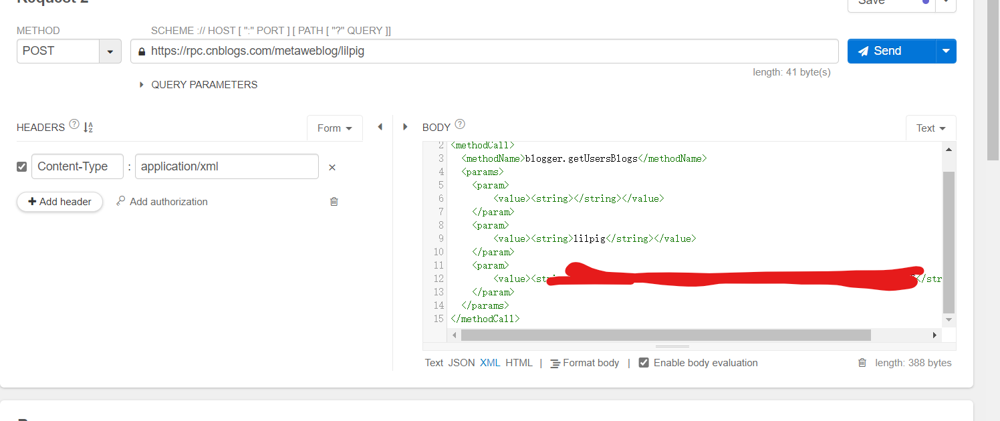
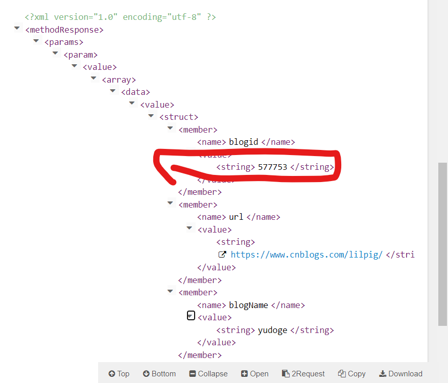
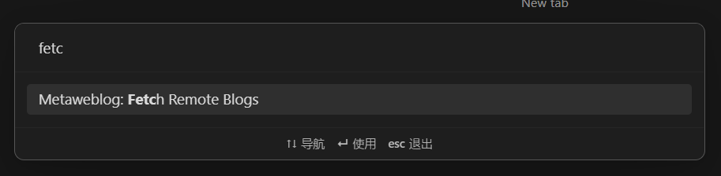
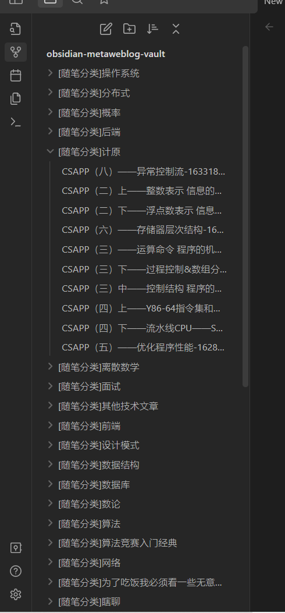
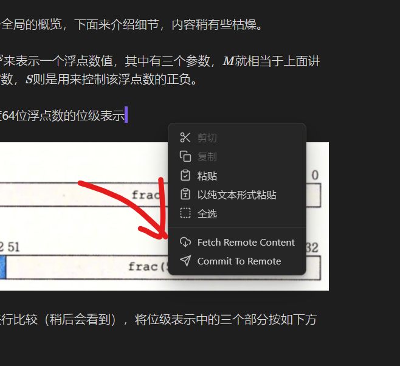
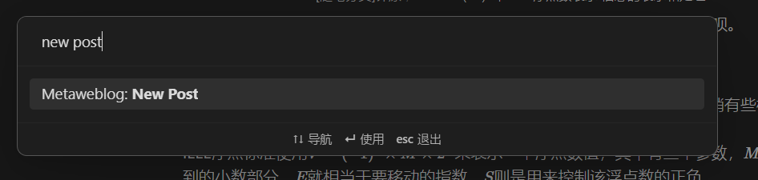
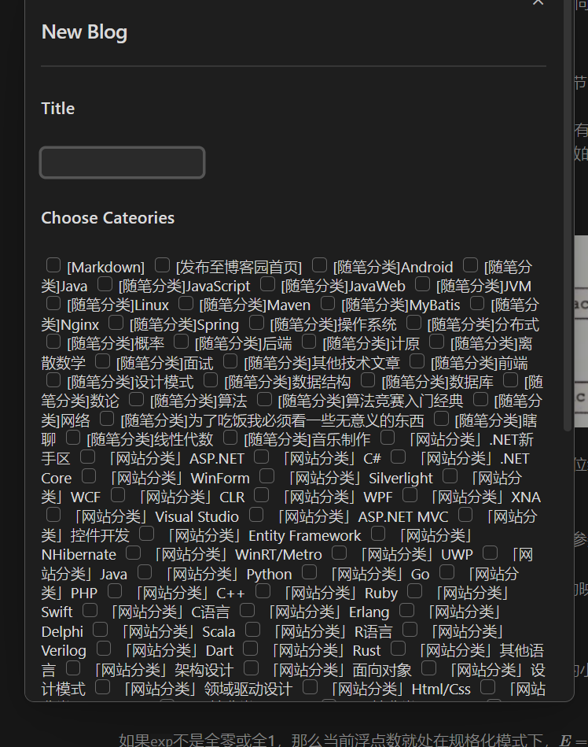
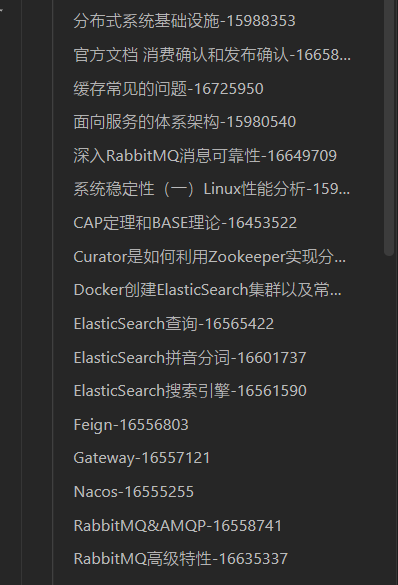

# Obsidian Metaweblog

将Obsidian与Metaweblog API整合工作。由于本人使用博客园，所以我只测试过博客园可以正常工作。

# Quick Start
## 1. 填写设置
开启插件后，你可能看到一些异常信息，因为你还没有填写插件的设置项

你需要告诉插件如下信息：
1. `appkey`：metaweblog api的appkey，如果你使用博客园，该项留空即可
2. `username`：你的用户名
3. `password`：密码，如果你使用博客园，请到`设置->其他设置->Metaweblog访问令牌`创建token
4. `url`：你的metaweblog访问地址
5. `vaultAbsolutePath`：你仓库的绝对路径，没时间研究VaultAPI，所以直接用了fs和path，需要你自己告诉我仓库的绝对路径
6. `blogId`：其实博客id可以自动获取，但由于存在一个用户有多个博客的情况，还是选择了手动输入。

你可以向你的Metaweblog API提供者发一个请求获取你的blogid

第一个参数是appkey，我这里是博客园，不用填写，第二个是用户名，第三个是密码。下面的返回值里就有blogid。

## 拉取post
第一次使用时，你的Vault应该是空的，你可以选择拉取所有post到本地（也可以不拉）。命令`Fetch Remote Blogs`可以将所有的远端博客拉取到本地（如果你的博文很多，这可能需要一段时间），并根据分类创建目录结构。

拉取后的效果

## 从远端更新和发布到远端

打开单篇文章后，`Fetch Remote Content`从远端更新内容到本地，`Commit To Remote`将本地内容推送到远端（并发布）

## 创建新文章
`New Post`命令可以创建新的文章

它，有点丑，不过你可以在这里填写你的文章标题和内容分类

点击最下面的创建即可，相应的文件会创建到Vault对应的文件夹下。

## 创建媒体对象/自动图片上传
这个功能主要用在自动上传图片上，它也不支持别的媒体对象。

当你剪切板里有图片的时候，你粘贴，它就会把图片作为媒体对象上传到你的Metaweblog提供者那里，并拿到URL插入回文章中。

## 博客园用户特别注意
如果你希望你的Markdown在博客园网站中正常显示，而不是显示为纯文本，请将`[Markdown]`分类勾选上。

# 文件命名规则
Vault中的博客文件以`文章title-postid`格式命名，`postid`用于定位远端post，请勿擅自修改。

# 不同分类下的同一篇文章
如果一篇文章在很多分类下，那么对应vault中，它也会在很多文件夹下。你更新其中一个文件夹下的文章，其它文件夹下的不会更新，如果需要保持同步，请手动使用`Fetch Remote Content`。

# ERROR xxxx 127.0.0.1:80

确保设置里你的URL填写了，实在不行重启插件。
